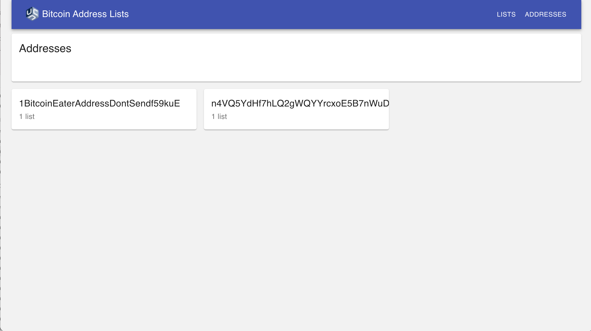

# Addresses page

The Addresses page is where a user can see all of the addresses they've created and how many lists each address is currently on. It should contain the following information:

* Page title: "Addresses" 
* List of Addresses
    * Each address in the list should contain the following:
        * The address string
        * The BTC value of the address
        * The network type of the address (Mainnet or Testnet)
        * The number of lists the address is on ("1 list" if only on one list, "{x} lists" if on more than 1)
        * A link to the [Address Detail Page](./AddressDetailPage) for the given address. Clicking on the address should take the user to the linked Address Detail Page.
* If there is an error when retrieving the addresses from the API, show the following error message: "We are unable to retrieve your addresses at this time. The team has been notified. Please try again later."

Here is an example of what a bare bones Addresses Page design could look like:

