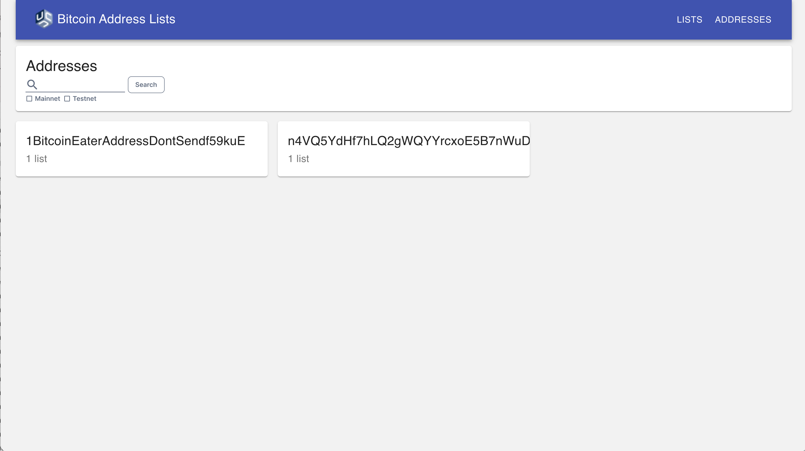

# Addresses Page Search
By adding Search to the Addresses Page, users will be able to more easily filter the set of Addresses displayed to just those with values matching a provided query or those matching a given network type filter. The following additions need to be made to the Addresses Page:

## Search Form
* Add a search form
    * Field Type: Text Input
        * Field Label: Search
        * Field Default Value: ''
        * Clear Icon: "x"
    * Field Type: Checkbox
        * Field Value: Mainnet
        * Field Default Value: Checked
    * Field Type: Checkbox
        * Field Value: Testnet
        * Field Default Value: Checked
    * Button: "Submit"
* All results shown by default (empty search query + both Mainnet and Testnet checkboxes checked)
* If both checkboxes are unchecked, display an error message that says: "Please check at least one of the Mainnet or Testnet boxes."
* The search form should have a max input length of 90 characters and cannot contain spaces. Display an error message if the user tries to enter more than 90 characters or adds space.
    * Error message: "Search query must be 90 characters or less and cannot contain spaces"
* The search query should remain in the form after submission (it should not clear)
* The "Submit" button should be enabled as long as the search query is either empty or is filled without validation errors. At least one checkbox also needs to be checked otherwise there will be a validation error. 
    * Button should be disabled if there are validation errors
    * Button should be disabled after a user submits a query until the results are fully loaded
* Clicking the Clear icon should clear the search query
* If there is an error while running the search query, display the following error message: "We cannot complete your search query at this time. The team has been notified and is looking into it. Please try again later."

Here is an example of how a bare bones search form design could look:

## Search Matching

* The query should match the value of addresses, with regard to case
    but without regard to position

### Displaying Search Matches
* Filter the displayed set of Addresses on the Addresses Page based on the matches
* Show a count of how many matches there are
* If there are no matches, display a message that says "There are no Addresses that match your search query."

  