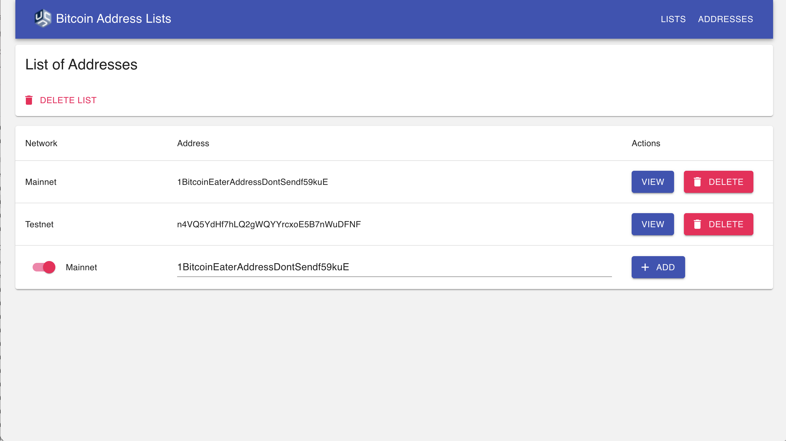

# List Show page

The List Show Page is where users can view and edit the details of an individual List. The page contains:

* The name of the List
* The number of addresses the List contains
* A button for deleting the List
    * Clicking the delete button should delete the List and also any addresses which are unique to the List. Addresses that are part of other Lists should be preserved. 
    * If there is an API error when attempting to delete the list, show the following error message: "We are currently unable to delete your list. Our team has been notified of the issue and is looking into it. Please try again later."
* If there is an error message when loading the List from the API, show the following error message: "We are currently unable to retrieve your list. Our team has been notified of the issue and is looking into it. Please try again later."
* A table of the List's addresses (see [Address Table](#address-table))

## Address Table

The Address Table is where users can view, delete, and add addresses to the List. It should follow the structure in the example below. The last row in the table should always contain the form for [adding a new address](#add-a-new-address) to the list. The rest of the rows in the table should contain [existing addresses](#existing-addresses). 

  Network                 | Address             | Actions
  ------------------------|---------------------|------------------------------
  Text: Testnet/Mainnet   | Text: address       | Button: View + Button: Delete
  Text: Testnet/Mainnet   | Text: address       | Button: View + Button: Delete
  Text: Testnet/Mainnet   | Text: address       | Button: View + Button: Delete
  Toggle: Testnet/Mainnet | Text Input: address | Button: + Add

Here is an example of what a bare bones Address Table design could look like:

### Existing Addresses

Addresses already on the list should appear as rows in the table. Each row should display:

* The address value & network type (Testnet or Mainnet) 
* A link to the Address Show page in the form of a "View" button
    * Clicking the View button should take the user to the Address Show Page for the given address
* A button for deleting the address from the list
    * Clicking the delete button should delete the address from the given List
    * If the address only appears on the given List, delete it from the database as well
    * If the address appears on other Lists, *don't delete* it from the database
    * If there is an error when attempting to delete the address, show the following error message: "We are unable to delete this address at the moment. The team has been notified and is looking into it. Please try again later."

### Add a new address

The table's last row should always be a form which can be used to add a new
address to the list. The form should contain the following fields:

* Field Type: Toggle
   * Field Values: [Mainnet, Testnet]
   * Default Field Value: Mainnet
* Field Type: Text Field
   * Field Label: Address
   * Field Default Value: ''
   * TODO spec this out: The "Value" should validate as a bitcoin address of the given
    network type
       * If the entered value is not a valid bitcoin address, display the following error message: "Please enter a valid Bitcoin address." 
* Field Type: Button ("Submit")

#### Form Submission
    
* Submit button should be disabled if the form has validation errors, if the text field value is empty, and during the processing of a recent submission (to prevent double submissions)
* If there is an error when submitting the address, show the following error message: "We are unable to create this address at the moment. The team has been notified and is looking into it. Please try again later."
* After a successful submission, the address should be appended to the addresses table directly above the form, and the form should be reset and cleared to prepare for another submission.
    * The network type used for the most recent form submission should be preserved. It does not need to be preserved if the user navigates away from the List Detail Page and returns back later.

### NEW Design
Here is an improved version of the original Address Table design:

