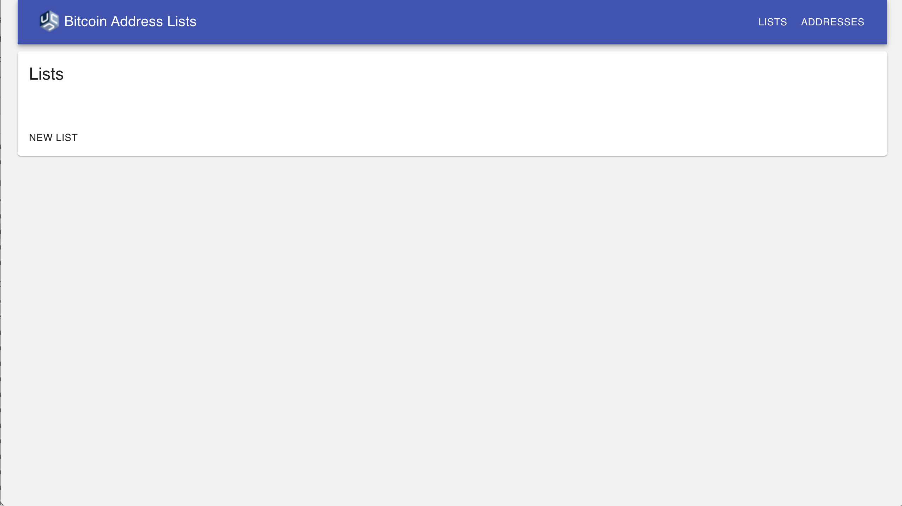
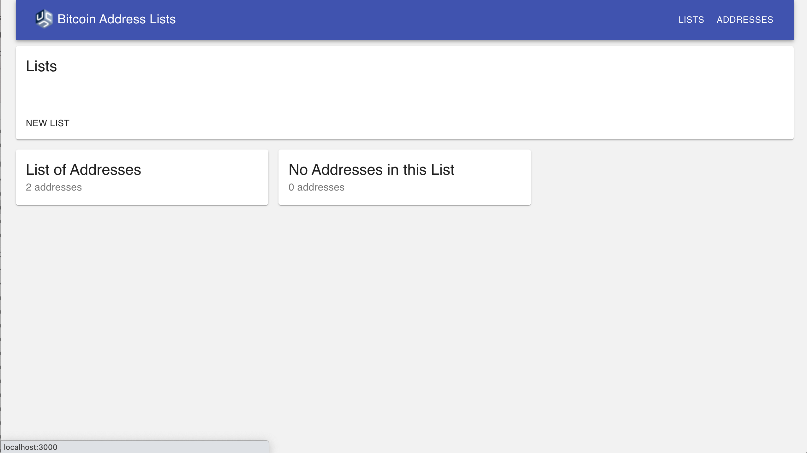

# Lists Page (index)

The Lists Page is the homepage of the application. It should display all of a user's previously created lists and provide a mechanism for initiating the creation of a new list. Clicking on the Unchained logo or the "Lists" link in the top nav should take users to the Lists Page.

* By default, lists should be sorted chronologically based on the datetime they were created
* Each List Item displayed should contain the following information
    * The name of the List
    * The number of addresses the List contains
    * A link to the List Show Page. Clicking on the List Item should take the user to the [List Detail Page](./ListDetailPage.md) for the clicked on List.
* If there is an error when retrieving Lists from the API, display the following error message: "We are currently unable to retrieve your lists. Our team has been notified of the issue and is looking into it. Please try again later."
* Display a "New List" button that when clicked takes the user to the New Lists Page

Here are examples of what a bare bones Lists Page design could look like:

