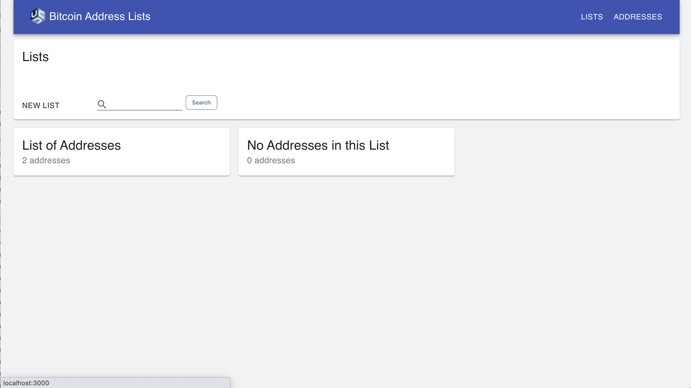

# Lists Page Search
By adding Search to the Lists Page, users will be able to more easily filter the set of Lists displayed to just those with values matching a provided query. The following additions need to be made to the Lists Page:

## Search Form
* Add a search form
    * Field Type: Text Input
    * Field Label: Search
    * Field Default Value: ''
    * Clear Icon: "x"
    * Button: "Submit"
* If the search form is empty, all lists should be displayed (default state)
* The search form should have a max input length of 50 characters (any character type is accepted). Display an error message if the user tries to enter more than 50 characters.
    * Error message: "Search query must be 50 characters or less"
* The search query should remain in the form after submission (it should not clear)
* The "Submit" button should be enabled as long as the query is either empty or is filled without validation errors
    * Button should be disabled if there are validation errors
    * Button should be disabled after a user submits a query until the results are fully loaded
* Clicking the Clear icon should clear the search form
* If there is an error while running the search query, display the following error message: "We cannot complete your search query at this time. The team has been notified and is looking into it. Please try again later."

Here is an example of how a bare bones search form design could look:

## Search Matching

* The query should be broken up by spaces into terms
* Each term should match against the name of each List without regard for case
    or position in the name
* Result sets for each matching term should be combined together into the final results list (inclusive `OR` search semantics)

### Displaying Search Matches
* Filter the displayed set of Lists on the Lists Page based on the matches
* Show a count of how many matches there are
* If there are no matches, display a message that says "There are no Lists that match your search query."